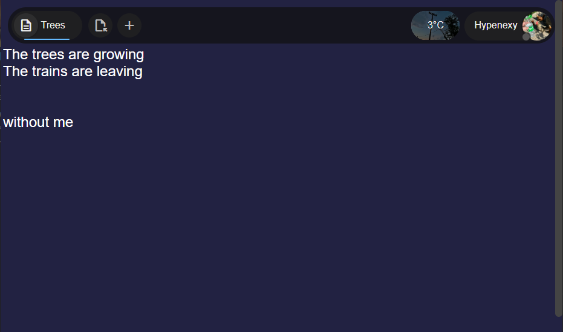
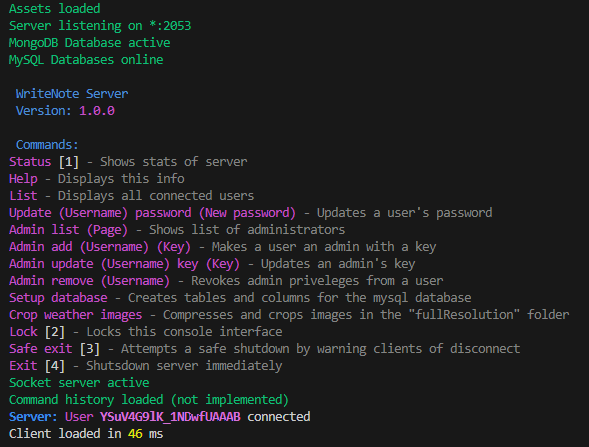

# WriteNote

[WriteNote](https://writenote.midelight.net) is an online note editor, capable of creating rich text, drawings, presentations, web sites and more. It comes with an Admin panel and a server.



## Server


## Requirements

A [MongoDB](https://www.mongodb.com/try/download/community) server.

A [MySQL](https://dev.mysql.com/downloads/mysql/8.0.html) server.

[Git](https://git-scm.com/downloads) is optional but you can use it to download this repository,
otherwise download it by pressing [<> Code] then [Download ZIP] then extract it.

[Node.JS](https://nodejs.org/en) is required to run the server.

[ipgeolocation](https://ipgeolocation.io/) and [OpenWeather](https://openweathermap.org) API Keys are required for weather service. They are both free but service might be subject to change.

I recommend using [VS Code](https://code.visualstudio.com/) to view and work on this project.

These are my [VS Code settings.json](https://code.visualstudio.com/docs/editor/settings#_settings-file-locations) to ease the development a little:
```
{
    "window.commandCenter": false,
    "git.enableSmartCommit": true,
    "git.confirmSync": false,
    "git.autofetch": true,
    "editor.stickyScroll.enabled": false,
    "workbench.editor.editorActionsLocation": "titleBar",
    "remote.autoForwardPorts": false,
    "editor.unicodeHighlight.nonBasicASCII": false,
    "liveServer.settings.donotShowInfoMsg": true,
    "actionButtons": {

        "commands": [
            {
                "name": "Start server",
                "cwd": "${workspaceFolder}/Server",
                "command": "node index.js",
            }
        ],
        "defaultColor": "white",
        "reloadButton": "↻",
        "loadNpmCommands": false
    },
    "liveServer.settings.root": "/App",
    "[json]": {
        "editor.defaultFormatter": "vscode.json-language-features"
    },
    "workbench.activityBar.location": "top"
}
```

These extensions are an extension to my settings to help with fast development.

[Live Server](https://marketplace.visualstudio.com/items?itemName=ritwickdey.LiveServer) Preview changes to the front-end in real-time

[VsCode Action Buttons](https://marketplace.visualstudio.com/items?itemName=seunlanlege.action-buttons) Adds the "Start server" button that's specified in the settings.json

[Rainbow CSV](https://marketplace.visualstudio.com/items?itemName=mechatroner.rainbow-csv) Highlight CSV files

[Markdown Preview Enhanced](https://marketplace.visualstudio.com/items?itemName=shd101wyy.markdown-preview-enhanced) Used to make this readme so pretty useful to me

## Installation
##### The following commmands are run in a terminal.

Download this repository and enter its folder
```
git clone https://github.com/Hypenexy/WriteNote.git
cd WriteNote
```

Install server dependencies
```
cd Server
npm i
```

Create the secret files with API keys and databases in the following locations
There are example files in the same locations with ".example" at the end

##### ./Server/code/databases/dbSettings.json
##### ./Server/code/user/APIKeys.json

Run the server and setup databases
```
node index.js
```
When the server fully loads type
```
setup database
```
Restart the server for good measure
```
exit
```

You can now enjoy your very own build of WriteNote

If you installed all the extensions and my settings.json then you can press
[Start server] in the bottom left and [Go Live] in the bottom right
to start the server and client.
